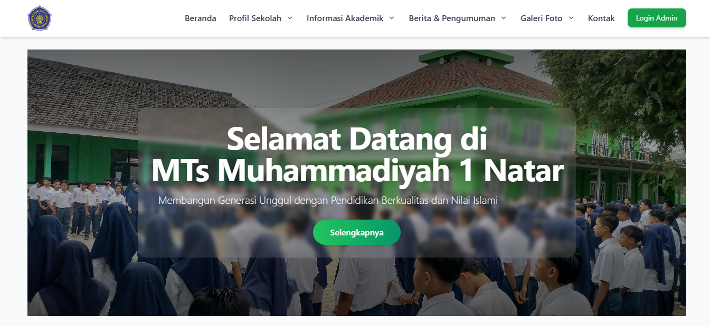
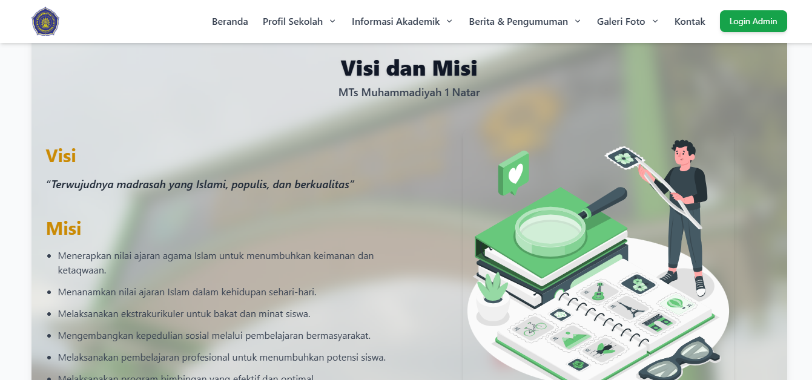
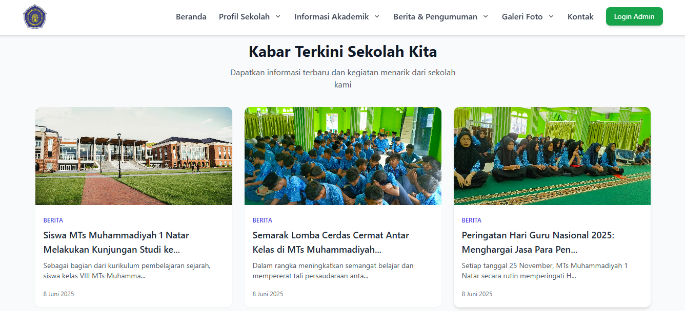
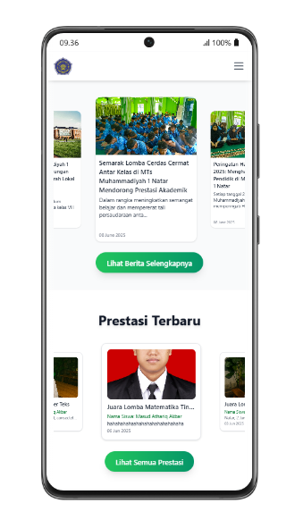
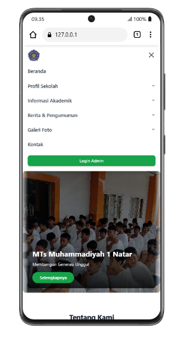

## 📸 Dokumentasi Tampilan Website MTs Muhammadiyah 1 Natar

Berikut beberapa tangkapan layar (screenshot) tampilan website MTs Muhammadiyah 1 Natar dalam versi **desktop** dan **mobile**.

---

### 🏠 1. Halaman Utama (Versi Desktop)
Tampilan awal website pada perangkat desktop.  
Menampilkan banner besar dengan tulisan **“Selamat Datang di MTs Muhammadiyah 1 Natar”**, menu navigasi di bagian atas, dan tombol *Selengkapnya* untuk melihat informasi lebih lanjut.

---

### 🎯 2. Halaman Visi dan Misi (Versi Desktop)
Menampilkan visi dan misi sekolah secara jelas dalam tata letak bersih dan mudah dibaca.  
Struktur halaman ini sama dengan halaman lain seperti *Profil Sekolah* atau *Informasi Akademik*.

---

### 📰 3. Halaman Berita (Versi Desktop)
Menampilkan daftar berita dan pengumuman sekolah dalam bentuk kartu (card).  
Setiap berita dilengkapi gambar, judul, dan ringkasan singkat yang bisa diklik untuk melihat detailnya.

---

### 📱 4. Halaman Utama (Versi Mobile - Berita & Prestasi)
Tampilan halaman utama pada perangkat mobile.  
Menampilkan bagian berita terbaru di bagian atas, dan di bawahnya daftar **prestasi siswa atau sekolah** yang disusun vertikal agar responsif di layar kecil.

---

### 📱 5. Halaman Utama (Versi Mobile)
Tampilan halaman utama secara keseluruhan di perangkat mobile.  
Desainnya tetap menampilkan banner sambutan, menu navigasi yang diubah menjadi *hamburger menu*, dan tata letak yang menyesuaikan ukuran layar.

---

## About Laravel

Laravel is a web application framework with expressive, elegant syntax. We believe development must be an enjoyable and creative experience to be truly fulfilling. Laravel takes the pain out of development by easing common tasks used in many web projects, such as:

- [Simple, fast routing engine](https://laravel.com/docs/routing).
- [Powerful dependency injection container](https://laravel.com/docs/container).
- Multiple back-ends for [session](https://laravel.com/docs/session) and [cache](https://laravel.com/docs/cache) storage.
- Expressive, intuitive [database ORM](https://laravel.com/docs/eloquent).
- Database agnostic [schema migrations](https://laravel.com/docs/migrations).
- [Robust background job processing](https://laravel.com/docs/queues).
- [Real-time event broadcasting](https://laravel.com/docs/broadcasting).

Laravel is accessible, powerful, and provides tools required for large, robust applications.

## Learning Laravel

Laravel has the most extensive and thorough [documentation](https://laravel.com/docs) and video tutorial library of all modern web application frameworks, making it a breeze to get started with the framework.

You may also try the [Laravel Bootcamp](https://bootcamp.laravel.com), where you will be guided through building a modern Laravel application from scratch.

If you don't feel like reading, [Laracasts](https://laracasts.com) can help. Laracasts contains thousands of video tutorials on a range of topics including Laravel, modern PHP, unit testing, and JavaScript. Boost your skills by digging into our comprehensive video library.

## Laravel Sponsors

We would like to extend our thanks to the following sponsors for funding Laravel development. If you are interested in becoming a sponsor, please visit the [Laravel Partners program](https://partners.laravel.com).

### Premium Partners

- **[Vehikl](https://vehikl.com/)**
- **[Tighten Co.](https://tighten.co)**
- **[WebReinvent](https://webreinvent.com/)**
- **[Kirschbaum Development Group](https://kirschbaumdevelopment.com)**
- **[64 Robots](https://64robots.com)**
- **[Curotec](https://www.curotec.com/services/technologies/laravel/)**
- **[Cyber-Duck](https://cyber-duck.co.uk)**
- **[DevSquad](https://devsquad.com/hire-laravel-developers)**
- **[Jump24](https://jump24.co.uk)**
- **[Redberry](https://redberry.international/laravel/)**
- **[Active Logic](https://activelogic.com)**
- **[byte5](https://byte5.de)**
- **[OP.GG](https://op.gg)**

## Contributing

Thank you for considering contributing to the Laravel framework! The contribution guide can be found in the [Laravel documentation](https://laravel.com/docs/contributions).

## Code of Conduct

In order to ensure that the Laravel community is welcoming to all, please review and abide by the [Code of Conduct](https://laravel.com/docs/contributions#code-of-conduct).

## Security Vulnerabilities

If you discover a security vulnerability within Laravel, please send an e-mail to Taylor Otwell via [taylor@laravel.com](mailto:taylor@laravel.com). All security vulnerabilities will be promptly addressed.

## License

The Laravel framework is open-sourced software licensed under the [MIT license](https://opensource.org/licenses/MIT).
